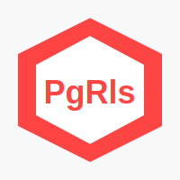

# PgRls Rails

> PostgreSQL Row Level Security: The Rails right way to do multitenancy

[![Contributors][contributors-shield]][contributors-url]
[![Forks][forks-shield]][forks-url]
[![Stargazers][stars-shield]][stars-url]
[![Issues][issues-shield]][issues-url]
[![MIT License][license-shield]][license-url]
[![LinkedIn][linkedin-shield]][linkedin-url]
[![Donate][donate]][paypal-donate-code]
[![Hireable][hireable]][hireable-url]

<p align="center">
  
  <h3 align="center">
    <a href="https://github.com/Dandush03/pg_rls">
        
    </a>
  </h3>

  <p align="center">
    PostgreSQL Row Level Security: The Rails right way to do multitenancy
    <br />
    <a href="https://github.com/Dandush03/pg_rls/wiki"><strong>Explore the docs »</strong></a>
    <br />
    <br />
    <a href="https://github.com/Dandush03/pg_rls/issues">Report Bug</a>
    ·
    <a href="https://github.com/Dandush03/pg_rls/issues">Request Feature</a>
  </p>
</p>

## Table of Contents

- [About The Project](#about-the-project)
- [Getting Started](#getting-started)
  - [Prerequisites](#prerequisites)
  - [Installation](#installation)
- [Usage](#usage)
- [Testing](#testing)
- [Development](#development)
  - [Development Workflow](#development-workflow)
  - [Releasing a New Version](#releasing-a-new-version)
- [Contributing](#contributing)
- [License](#license)
- [Contact](#contact)
- [Acknowledgements](#acknowledgements)

## About The Project

It's time we start doing multitenancy right! You can avoid creating a separate Postgres schema/databases for each customer or trying to ensure the WHERE clause of every single query includes the particular company. Just integrate PgRls seamlessly to your application.

This gem will integrate PostgreSQL RLS to help you develop a great multitenancy application.

## Getting Started

### Prerequisites

- Ruby (~> 3.0)
- ActiveRecord (~> 7.0)
- PostgreSQL (> 9.0)
- Warden
- pg (~> 1.2)

### Installation

1. Add this line to your application's Gemfile:

   ```ruby
   gem 'pg_rls'
   ```

2. Execute:

   ```bash
   bundle install
   ```

   Or install it yourself with:

   ```bash
   gem install pg_rls
   ```

## Usage

1. Generate the necessary files:

   ```bash
   rails generate pg_rls:install company  # where 'company' is your tenant model name
   ```

   You can change 'company' to anything you'd like, for example, 'tenant'.

2. For any new model that needs to be under RLS:

   ```bash
   rails generate pg_rls user  # where 'user' is your model name
   ```

3. Switch to another tenant:

   ```ruby
   PgRls::Tenant.switch :app  # where 'app' is your tenant name
   ```

## Testing

If you encounter `PG::InsufficientPrivilege: ERROR: permission denied`, override permissions by running:

```bash
RAILS_ENV=test rake db:grant_usage
```

For database cleaning strategies, implement the following in your `spec/rails_helper.rb`:

```ruby
config.before(:suite) do
  FactoryBot.create(:company, subdomain: 'app')
  PgRls::Tenant.switch :app
end
```

## Development

After checking out the repo, run `bin/setup` to install dependencies. Then, run `rake spec` to run the tests. You can also run `bin/console` for an interactive prompt.

### Development Workflow

Before each push, follow this workflow:

1. Run quality checks:

   ```bash
   ./review_code.sh
   ```

   This script performs:
   - Rubocop
   - RSpec (100% code coverage required)
   - Steep (type checking)

2. Ensure 100% documentation coverage.

3. Run tests:

   ```bash
   bundle exec rspec
   ```

### Releasing a New Version

1. Update the version number in `version.rb`
2. Run `bundle exec rake release`

## Contributing

1. Fork the Project
2. Create your Feature Branch (`git checkout -b feature/AmazingFeature`)
3. Commit your Changes (`git commit -m 'Add some AmazingFeature'`)
4. Push to the Branch (`git push origin feature/AmazingFeature`)
5. Open a Pull Request

## License

Distributed under the MIT License. See `LICENSE` for more information.

## Contact

If you need help, feel free to reach out through the repository [issues](https://github.com/dandush03/pg_rls/issues) page or contact me via [LinkedIn](https://www.linkedin.com/in/daniel-laloush/).

Project Link: [https://github.com/Dandush03/pg_rls](https://github.com/Dandush03/pg_rls)

## Acknowledgements

- [GitHub Emoji Cheat Sheet](https://www.webpagefx.com/tools/emoji-cheat-sheet)

- [Choose an Open Source License](https://choosealicense.com)
- [GitHub Pages](https://pages.github.com)

## Show your support

Give a ⭐️ if you like this project!

If this project help you reduce time to develop, you can give me a cup of coffee :)

[![paypal][paypal-url]][paypal-donate-code]

[contributors-shield]: https://img.shields.io/github/contributors/Dandush03/pg_rls.svg?style=flat-square
[contributors-url]: https://github.com/Dandush03/pg_rls/graphs/contributors
[forks-shield]: https://img.shields.io/github/forks/Dandush03/pg_rls.svg?style=flat-square
[forks-url]: https://github.com/Dandush03/pg_rls/network/members
[stars-shield]: https://img.shields.io/github/stars/Dandush03/pg_rls.svg?style=flat-square
[stars-url]: https://github.com/Dandush03/pg_rls/stargazers
[issues-shield]: https://img.shields.io/github/issues/Dandush03/pg_rls.svg?style=flat-square
[issues-url]: https://github.com/Dandush03/pg_rls/issues
[license-shield]: https://img.shields.io/github/license/Dandush03/pg_rls.svg?style=flat-square
[license-url]: https://github.com/Dandush03/pg_rls/blob/master/LICENSE.txt
[linkedin-shield]: https://img.shields.io/badge/-LinkedIn-black.svg?style=flat-square&logo=linkedin&colorB=555
[linkedin-url]: https://www.linkedin.com/in/daniel-laloush/
[hireable-url]: https://www.linkedin.com/in/daniel-laloush/
[paypal-url]: https://www.paypalobjects.com/en_US/i/btn/btn_donateCC_LG.gif
[paypal-donate-code]: https://www.paypal.com/donate?hosted_button_id=QKZFZAMQNC8JL
[donate]: https://img.shields.io/badge/Donate-PayPal-blue.svg
[hireable]: https://cdn.rawgit.com/hiendv/hireable/master/styles/flat/yes.svg
